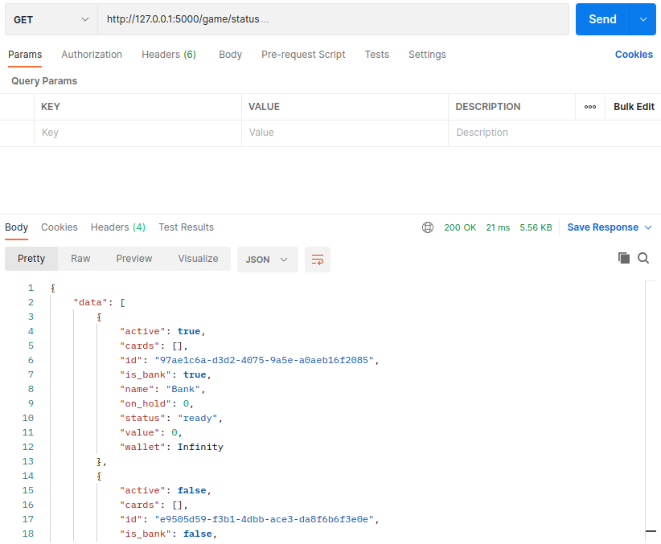
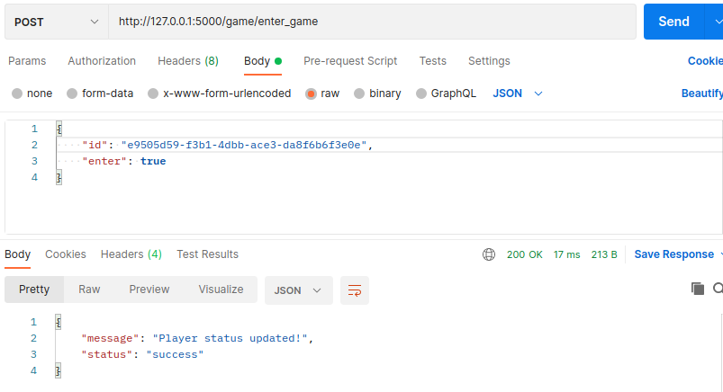
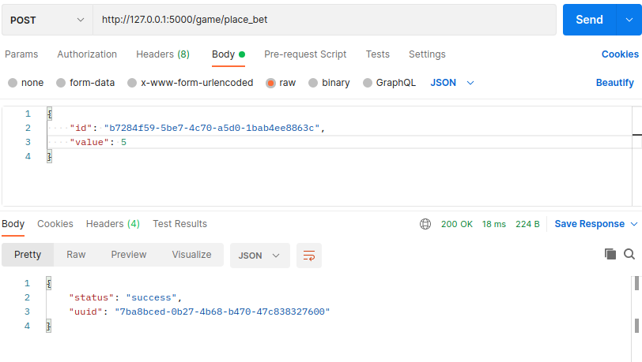
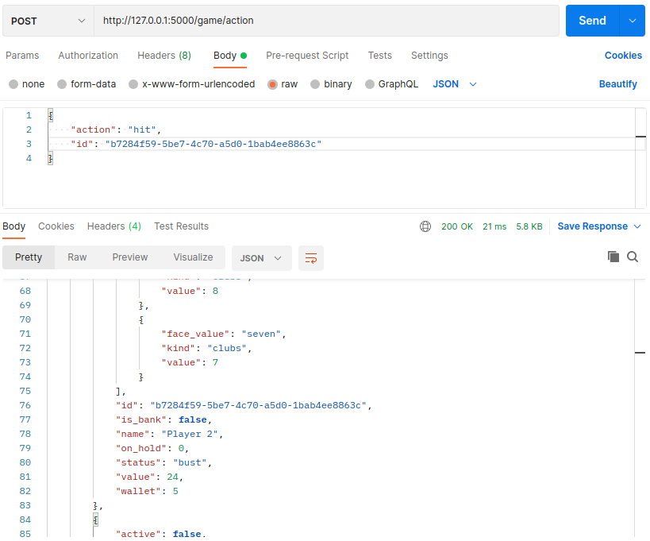
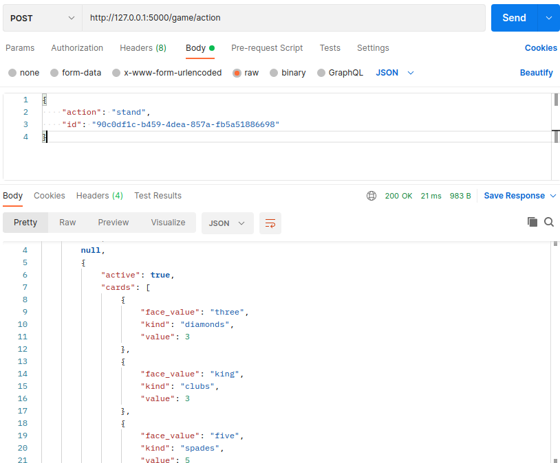
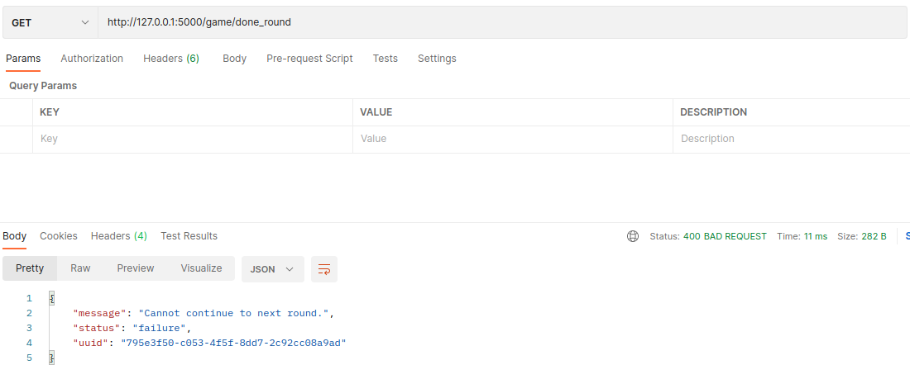
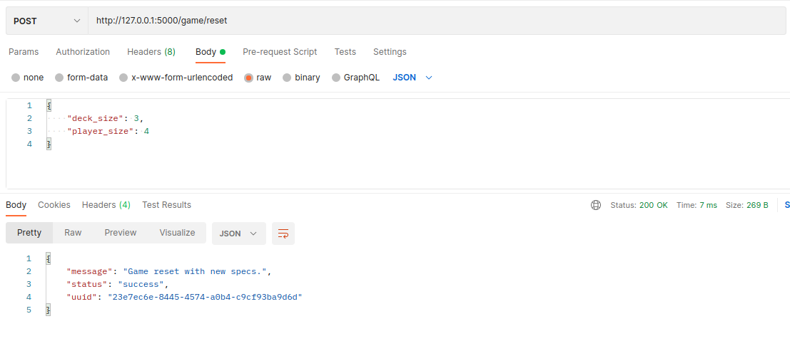

# TWENTY ONE

A Flask Rest API based twenty one game. Initially when running the project,
the default setup is 3 players, 1 bank and one deck of cards. This readme
contains all the important information related to the code structure, features,
sample REST APIs, and how to run the game.

## Pre-requestite to run the game
The project is intended to work with a database as it was designed to save player status to
a sqlite3 database given in `db/twentyone.db`. *However the db was setup but not integrated with
the game yet.*
In order to run the game, the database path needs to be added as environment variable first.

### Steps:

### Configuring and Running The Application

The following steps are required to run the application


#### Configure The Database

This **project** support to work with SQLite databases. 
With the database configured, you need to make the database URI 
containing the database credentials to access it. 
This URI will be set later for application through 
environment variables. Here use the same sqlite database provided with
the project, i.e `db/twentyone.db`.

Database URIs examples:

	SQLite: sqlite:////home/neeraj/workspace/twentyone-api/db/twentyone.db
set this as environment variable by:
```shell
export FLASK_ENV=development
export DATABASE_URL=sqlite:////home/neeraj/workspace/twentyone-api/db/twentyone.db
```
use a proper path for the database file rather than the example given here.


#### Install The Dependencies

To make sure about the *[dependency isolation](https://12factor.net/dependencies "dependency isolation")* is recommended to use the *[venv](http://https://docs.python.org/3/library/venv.html "venv")* to create a virtual environment.

After downloading this project, open the project directory and install the dependencies with the below *pip* command: 

`pip install -r requirements.txt`

*Note that python 3 is required to run this project*


#### Perform Database Migration (not necessary)

You can do the database migrations with the following commands:

`flask db init`<br>
`flask db migrate`<br>
`flask db upgrade`<br>

Note: This will create the *migrations* folder to the application.


#### Running

**Development**

In development, you can use the built-in development server with the `flask run` command. Remember to set the environment and the database URI:

`flask run`

The application will run by default in  port 5000.

**Production** 

In the production environment, you just need to set the DATABASE_URL environment variable. Then you can use the command:

`waitress-serve --call 'app:create_app'`

[Waitress](https://docs.pylonsproject.org/projects/waitress/en/stable/ "Waitress") is the production WSGI server used for this project.

**Unit Tests**

To run the test, you need to set the DATABASE_URL environment variable too. Like in development, you can use a test/.env to set the DATABASE_URL variable.

Run the test with the following command:

`python -m pytest`

You can also run with coverage:

`coverage run -m pytest`


### Configuring the Secret Key

The secret key is kept in the config.py module at the root of the application. Edit the `SECRET_KEY` class variable of the Production class with some random bytes. You can use the following command to output a random secret key:

	python -c 'import os; print(os.urandom(16))'
	b'_5#y2L"F4Q8z\n\xec]/'


## Examples of Use

You can use Postman to try the HTTP REST API and play this game. The 
*Postman Collections* of requests can be found in the root directory with name `twenty_one_rest.json`. Export it into postman collections to play with it. 

This Postman collection was made based on:

	Host: 127.0.0.1
	Port: 5000

**Note: To access a protected view, all we have to do is send in the JWT with the request. By default, this is done with an authorization header that looks like::**

	Authorization: Bearer <access_token>

JWT is not used in the game play so this can be avoided when playing.

### REST API Example (How to play)
This section will guide you to how to use the rest api to play the game.

- First upon starting the application with `flask run`, flask-restful will start in port 5000 with its apis exposed.
- The game will initialize with 3 players and one deck of card by default.
- If you want to change the deck size and player size, run the `/game/reset` api given below.
1. After the game is initialised, first task is to check the status of the game, i.e get the status of deck of cards and players.
  - curl command:
    - ```shell
        curl --location --request GET 'http://127.0.0.1:5000/game/status'
      ```
  - response:
    - 
2. Second, willing players need to enter the game by calling the api: `/game/enter_game` where post body of json consists of which player (id) needs to enter and if enter is true or false, if false the player entry is negated.
   - curl command (replace the id with player id from the game status):
     - ```shell
       curl --location --request POST 'http://127.0.0.1:5000/game/enter_game' \
       --header 'Content-Type: application/json' \
       --data-raw '{
         "id": "e9505d59-f3b1-4dbb-ace3-da8f6b6f3e0e",
         "enter": true
       }'
       ```
   - response:
     - 
3. Do this to all the players who want to enter this round of the game.
4. In the end check their status using the status api(1), you find that the key `active` is set to `true` now.
5. Now according to requirement, all players who entered the round will be a card each from the deck. This is done by running the api
   `/game/start_round`
   - curl command: 
     - ```shell
       curl --location --request GET 'http://127.0.0.1:5000/game/start_round' 
       ```
   - response:
     - 
6. After first round of card distribution to each player, the players need to place bet one by one.
   Run this api for each active player ids who are in the game, one after the other and provide the bet value in the
    key `value`. api: `/game/place_bet`
    - curl command:
      - ```shell
        curl --location --request POST 'http://127.0.0.1:5000/game/place_bet' \
        --header 'Content-Type: application/json' \
        --data-raw '{
        "id": "b7284f59-5be7-4c70-a5d0-1bab4ee8863c",
        "value": 5
        }'    
        ```
    - response:
      - 
7. The second round goes and each player who placed bet will get second card from the deck now.
    Now to run the second round, run the `/game/start_round` api (5) with additional parameter in the GET request,
   where round=2 is the key-value param to be provided.
    - curl command:
      - ```shell
        curl --location --request GET 'http://127.0.0.1:5000/game/start_round?round=2'
        ```
    - response:
      - 
8. Now each player has two cards dealt, its time for each player to do actions (hit/stand). TODO split action
    is yet to be implemented. Each player one by one will do actions by runnning the `/game/action` api. When one player
    goes to stand or gets bust, the next player can do action by provided his/her player id to the api, as given in the example. The actions to be     provided to key `action` are `hit` and `stand`.
   - curl command:
     - ```shell
        curl --location --request POST 'http://127.0.0.1:5000/game/action' \
        --header 'Content-Type: application/json' \
        --data-raw '{
           "action": "hit",
           "id": "b7284f59-5be7-4c70-a5d0-1bab4ee8863c"
        }'
       ```
     - response:
       - 
9. Once each active player is either bust or in standing status, the bank will draw
       cards based on the rule provided in the document. For running bank actions, the same action api is run with the bank (player bank)'s id.
       You don't need to provide key `action` in the request body for bank actions as bank actions is pre-determined by the logic given in the 
       problem statement document and will end in bank getting stand or busted.
   - curl command:
     - ```shell
                    curl --location --request POST 'http://127.0.0.1:5000/game/action' \
                    --header 'Content-Type: application/json' \
                    --data-raw '{
                        "id": "90c0df1c-b459-4dea-857a-fb5a51886698"
                    }'
       ```
   - response:
     - 
10. Once Bank action is complete, the winner is determined and the output of bank action api (previous api) gives all the winner players(or bank) as response with the updated wallet of 2 times the bet that was stored in on_hold.
11. If you check the `/game/status` api, you can see the player annd bank status, those whose status is `win` are the winnners of that round and they have their profit added to the wallet.
12. There are two more additional apis `/game/done_round` to get to the second round of the match with players who are still having valid maximum betting amount in their wallet, the other apis is the 
    reset api `/game/rest` which resets decks and player states to default values. User can provide post data `deck_size` and `player_size` to mention the number of decks and players for the round coming up.
    - 
    - 
13. Once another round is started, follow along the same path from 1.

### Technical Design/Architecture
The design follow a MVC (Model-View-Controller) architecture, where the interaction is 
initiated by the rest apis. The API handles requests from views, sends it to the model which is the utils and setup class in the program structure.
The blueprint/api also provided responses to the views. There is also a connection to the database made, which for now is not integrated yet.

#### Project Layout
**app/authentication.py:** Contains function decorators used to control JWT tokens authentication.

**app/blueprint**: The *controller* layer (API).

- **handlers.py**: Contains functions to deal with the error exceptions of API.
- **account.py**: A blueprint to organize and group views related to the `/account` endpoints.
- **auth.py**: A blueprint to organize and group views related to the `/auth` endpoints.
- **game.py**: A blueprint to organize and group views related to the `/game` endpoints which provide the game play functionalities.
- **index.py**: A blueprint to organize and group views related to the index endpoint.


**app/commands.py**: Package to keep the commands line. (Not used)

**app/config.py**: Keeps the settings classes that are loading according to the running environment.

**app/database.py:**: The database bootstrapper.

**app/exceptions.py:**: Custom exceptions.

**app/__init__.py**: Contains the factory function 'create_app' that is responsible for initializing the application according to a previous configuration.

**app/local.env**: A sample of the *.env* config file..

**app/model**: The *model* layer for database and tokens.

- **models.py**: Persistent objects of the SQLAlchemy.
- **repository.py**: Contains Repository generic class.
- **token_respository**: Contains TokenRepository class.
- **user_repository.py**: Contains UserRepository class.

**app/api**: The *model* layer for game components (Players, Cards).

- **card.py**: Model for a specific card from a deck.
- **players.py**: Model for a specific player in the game.

**app/utils**: Utility functions

- **constants.py**: Constants stored here for example minimum betting amount is set here.
- **util.py**: Utility functions needed for gaming logic stored here.


#### Features
- Apart from `split` action, all the features are added with some extra features
    to improve usability like setting minimum betting amount, setting number of decks, setting number of players, etc.

NOTE: It will be easier to work with Postman by exporting the `twenty_one_rest.json` to it as collections and running it as this will eliminate curl commands anc can test easily with UI.
Using a virtual environment is recommended as the dependencies version needs to be exactly the same as mentioned in the `requirements.txt` file for the project to work perfectly. 

## Author

[Neeraj Sathyan](https://github.com/neerajsathyan/)
